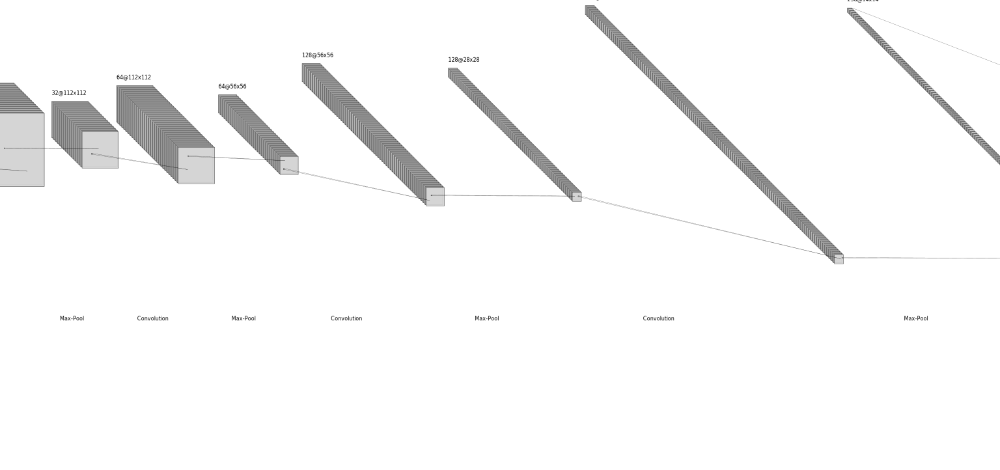
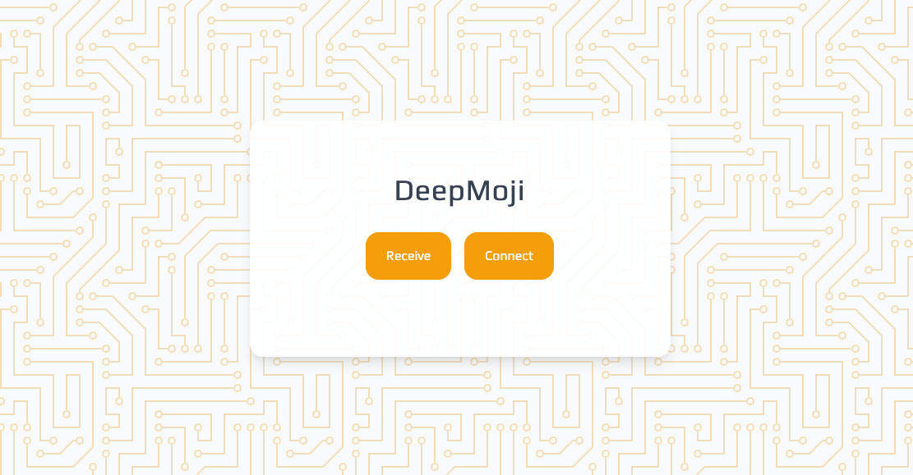
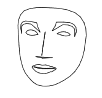
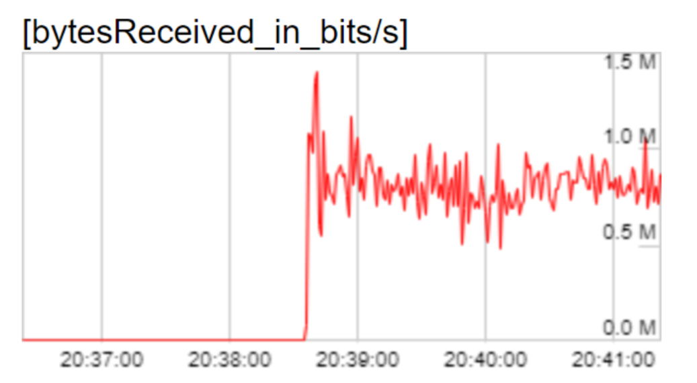
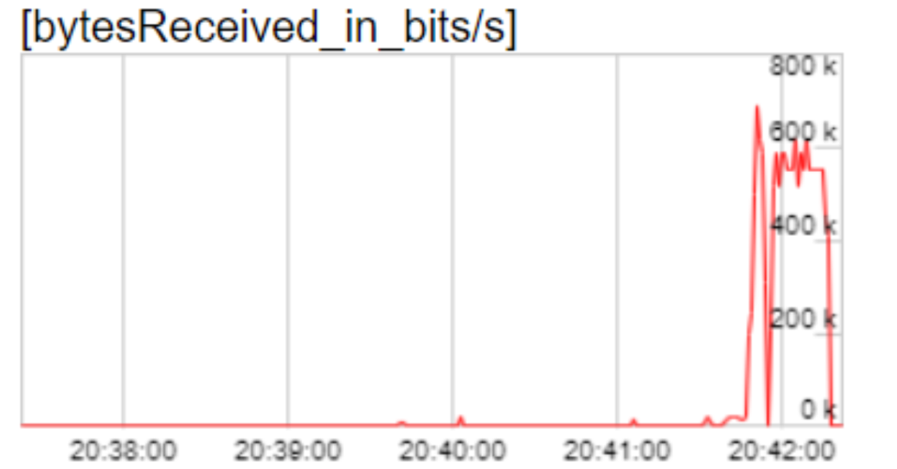

# DeepMoji Dokumentation
DeepMoji wurde für die Semesterarbeit im Modul DeepL entwickelt. Im Folgenden befindet sich die Dokumentation und Reflexion zu unserem Vorgehen.

## Model
Wir haben viele Iterationen beim Aufbau des Models durchgeführt, um zu einem guten Model zu kommen. Dazu haben wir zuerst damit gestartet verschiedene Datensätze anzuschauen und auszuprobieren, um einen Datensatz mit guter Qualität und genügend vielen Daten zu kommen. 

### Datensatz auswahl
Wir haben mit dem [aflw2k3d](https://www.tensorflow.org/datasets/catalog/aflw2k3d) Datensatz begonnen, welchen wir als Erstes gefunden haben. Die 2000 Bilder mit je 68 Gesichtspunkten sind jedoch mehr zur Evaluation von Facial Landmark detection models geeignet als zum Training, da sie besonders schwierige Bilder mit schwierigen Gesichtposen beinhalten. Deswegen war es schwer eine gutes Model darauf zu bauen.

Als nächstes haben wir ein [Kaggle-Datensatz](https://www.kaggle.com/c/facial-keypoints-detection/data?select=training.zip) verwendet. Dieser hatte 7049 Bilder, somit wir mehr Daten zum Training verwenden konnten. Jedoch waren nur 30 Gesichtspunkte auf den Bildern gelabelet, was für uns nicht aussreicht, um die Person zu zeichnen für den Video-Call.

Somit haben wir noch den [the300w_lp](https://www.tensorflow.org/datasets/catalog/the300w_lp) Datensatz angeschaut, welcher über 61'000 Daten mit je 68 Landmarks besizt. Der Datensatz ist nicht ganz perfekt, da er Bilder mit schwarzem Rand zeigt und viele Bilder ein wenig absichtlich verzogen sind. Jedoch bietet er viele verschiedene Kopfposen, welche dem Model beim Trainieren helfen. Der Datensatz wird auf der Website ebenfalls zum Trainieren von den Facial Landmarks empfohlen und wir haben uns entschieden mit diesem Datensatz unser Model zu bauen und darauf weiter zu iterieren und optimieren. 

Das Finden eines guten Datensatzes war für uns nicht ganz so einfach wie erwartet, und hat schon einige Zeit aufgewendet, bis wir auf den the300w_lp gestossen sind, obwohl er ebenfalls im Tensorflow Katalog zu Verfügung steht.

### Model Aufbau
Weiter haben wir verschiedene Modelle aufgebaut, trainiert und evaluiert, um das beste Model für unseren Task zu entwickeln. Hier werden wir einige Versuche und Resultate dokumentieren.

#### CNN
Zuerst haben wir ein CNN aufgebaut mit mehreren Conv2D und MaxPooling Schichten, sowie ein paar Dense Layern, um aus den Bildern zu den 136 (x- und y- Werte) Facial Landmarks zu kommen und haben diesen mit einem Adam Optimizer und dem Mean squared error trainiert. Jedoch haben wir keine normalisierte Y-Daten verwendet, sondern einfach auf dem 450 Pixel breit und langem quadratischem Bild. Das Training mit normalisierten Y-Daten hat nicht geklappt, da bei der Prediction die Landmarks alle trotz zurückscaling zu zentriert und zu nahe zueinander waren. Deshalb wurde mit den nicht normalisierten Y-Daten weitergefahren. Deshalb sind auch der Loss beim Trainieren nicht wie gewohnt sehr nahe an 0, sondern fängt sehr hoch bei Tausend an und fällt dann auf ein paar Hundert ab. Die Bild-Input Daten wurden jedoch mit einem keras Layer (Normalization) normalisiert.

Wir haben noch verschiedene Optimizer und Varianten mit dem CNN Model versucht, welche im Jupyter Notebook `experiments.ipynb` zu finden sind. Dazu haben wir mit einem Standard CNN begonnen (Convolution2D, MaxPool2D, Flatten und Dense). Nach und nach haben wir einige Optimierungen eingebaut, wie die BatchNormalization, ein Layer, welcher die Daten normalisiert, was die Trainingszeit verkürzen soll. Danach ein Dropout-Layer, welcher Overfitting verhindern soll, jedoch aber den Loss verschlechterte.

Das Model-Diagramm wurde mit folgender Website erstellt: [http://alexlenail.me/NN-SVG/LeNet.html](http://alexlenail.me/NN-SVG/LeNet.html)

#### Transferlearning
Wir haben einen Versuch mit dem VGG19 und den Imagenet Gewichten als Base Model gestartet. Die Resultate des Transfer Learning Models hat die besten Loss erzielt, dauerte aber länger zum Trainieren. Der Loss nach 50 Epochen war 26, im Vergleich dazu, unsere eigenen CNN Modelle hatten einen Loss zwischen 100 und 400. Deshalb wollten das Transferlearning Model in unserer Website gebrauchen, jedoch konnte die konvertierte TensorflowJS Version nicht ins Javascript importiert werden, sondern warf eine Exception, dass ein Layer nicht verfügbar ist. Bei unseren eigenen CNN Modellen hat es dafür geklappt, deshalb haben wir es mit ihnen ausgetestet.

### Python keras Model als TensorflowJS Model in einem Frontend bereit stellen
Da unser Model in einem Jupyter Notebook mit Python entwickelt wurde, mussten wir es in eine kompatibele Form für unser VueJS-Frontend konvertieren. Dazu exportieren wir unser Python Keras Model zu einem TensorflowJS Model. Den Ordner mit dem `model.json` kopierten wir dann zum `public` Ordner im Frontend, sodass das Frontend auf die Daten zur Laufzeit zugreifen kann. Während der Videoübertragung wird das Model verwendet, um eine Prediction zu dem Facial landmarks zu machen und die 68 Punkte auf dem Canvas darzustellen und zu senden statt dem ganzen Video.

https://www.tensorflow.org/js/tutorials/conversion/import_keras

## Frontend

DeepMoji ist als [Web-Applikation](https://deepmoji-b75dc.web.app/) verfügbar und kann somit auf allen gängigen Plattformen verwendet werden. Die Applikation 
verwendet Vue.js als Framework.

### Peer-to-peer connection

Um die extrahierten Datenpunkte vom Sender zum Empfänger zu übertragen, wird WebRTC verwendet, ein offener Standard für 
das Web. Dabei wird die [PeerJS](https://peerjs.com/) Library zu Hilfe genommen, um einen Teil der Komplexität zu abstrahieren. 
Während via einem Data Channel die Datenpunkte übertragen werden, wird ein Media Channel genutzt, um Audiosignale zu mitzusenden.

Via Webcam werden die Gesichtspunkte detektiert und über den Data Channel an einen anderen Peer geschickt. Dort werden die 
Punkte auf ein Canvas projiziert (siehe weiter unten). Dasselbe passiert auf der Maschine des Peers, es entsteht also eine 
bidirektionale Verbindung.

### Projection
Das face-landmarks-detection Model von Tensorflow generiert aus jedem Gesicht 478 Koordinaten, welche verschiedenen Punkten des Gesichts entsprechen. Das Mapping der Punkte ist auf dem Bild sichtbar.

Aus diesen Punkten muss nun erneut eine Darstellung des Gesichts erstellt werden. Um den Aufwand im Rahmen der Semesterarbeit zu halten, haben wir uns dazu entschieden, mit HTML Canvas die wichtigsten Teile der Gesichter nachzuzeichnen. Das Zeichnen der Gesichter ist auch für Geräte mit schwacher Rechenlsietung kein Problem.

Das Ergebnis des Models liefert nicht nur die rohen Daten, sondern gruppeirt sie auch in Gesichtspartien. So können z.B. einfach alle Punkte des linken Wangenknochens abgefragt werden, was das Zeichnen sehr vereinfacht. Um die Geischter erkennbar und doch simpel zu halten, haben wir uns für folgende Partien entschieden, welche gezeichnet werden:
- Silhouette
- linkes Auge
- linke Augenbraue
- rechtes Auge
- rechte Augenbraue
- innere Lippe
- äussere Lippe
- Nasenumriss
- Nasenspitze

Das Ergebnis ist in der untenstehenden Abbildung ersichtlich. Damit sind die Gesichter als solche erkennbar und auch Emotionen können übertragen werden.

#### Weitere Möglichkeiten
Mit anderen Lösungsansätzen, welche jedoch nicht realsiiert wurden, könnte das Gesicht der Person noch besser visualisiert werden, ohne dass das eigentliche Bild übertragen werden muss. So könnte z.B. ein Comic-Charakter erstellt werden, welcher der eigentlichen Person sehr ähnlich sieht. Dieser Charakter könnte dann anhand der Datenpunkte animiert werden. Ein weiterer Ansatz wäre, dass mit einem zweiten Modell anhand eines einzelnen Bilds des Gesichts der Person, die Datenpunkte auf dieses Bild übertragen werden können und so das "tatsächliche Gesicht" animiert wird. Da wir jedoch keine bestehende Lösung dazu gefunden haben, haben wir diese Ansätze für die Semesterarbeit nicht weiterverfolgt.

### Vergleich Teams / DeepMoji
Um am Schluss zu sehen, ob DeepMoji nun weniger Daten gebraucht für einen Call haben wir die Anzahl Daten gesendet mit den Chrome Webtools in bit/s gemessen: chrome://webrtc-internals/

Teams Nutzung:

Deepmoji Nutzung:

Wie man sieht, sendet Deepmoji weniger Daten als Teams mit etwa 500k Bits. Teams sendet aber nur ein wenig mehr mit etwa 750k Bits. Dies führen wir darauf zurück, das Teams wahrscheinlich schon viele Kompressionsmöglichkeiten anwendet, und wir eigentlich noch eher verschwenderisch immer ein ganzes Objekt senden mit mehr Landmark-Punkten als wir brauchen und nicht nur die Punkte, die sich geändert haben. Es ist also schon mal ein guter Anfang, aber es existiert noch einiges an Optimierungspotential.